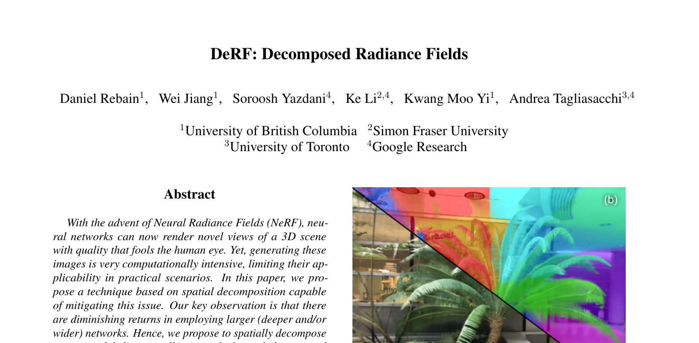

<link rel="stylesheet" href="style.css">

### Paper

### Abstract

With the advent of Neural Radiance Fields (NeRF), neural networks can now render novel views of a 3D scene with quality that fools the human eye. Yet, generating these images is very computationally intensive, limiting their applicability in practical scenarios. In this paper, we propose a technique based on spatial decomposition capable of mitigating this issue. Our key observation is that there are diminishing returns in employing larger (deeper and/or wider) networks. Hence, we propose to spatially decompose a scene and dedicate smaller networks for each decomposed part. When working together, these networks can render the whole scene. This allows us near-constant inference time regardless of the number of decomposed parts. Moreover, we show that a Voronoi spatial decomposition is preferable for this purpose, as it is provably compatible with the Painter's Algorithm for efficient and GPU-friendly rendering. Our experiments show that for real-world scenes, our method provides up to 3x more efficient inference than NeRF (with the same rendering quality), or an improvement of up to 1.0~dB in PSNR (for the same inference cost).

### Videos

<video controls autoplay loop>
  <source type="video/mp4" src="horns.mp4">
</video>
<video controls autoplay loop>
  <source type="video/mp4" src="trex.mp4">
</video>
<video controls autoplay loop>
  <source type="video/mp4" src="flower.mp4">
</video>
<video controls autoplay loop>
  <source type="video/mp4" src="leaves.mp4">
</video>
